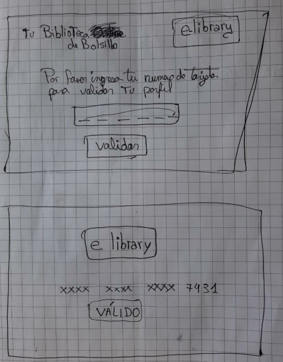
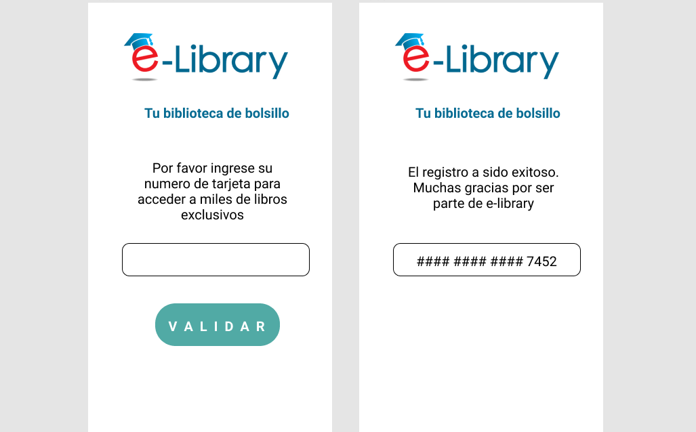
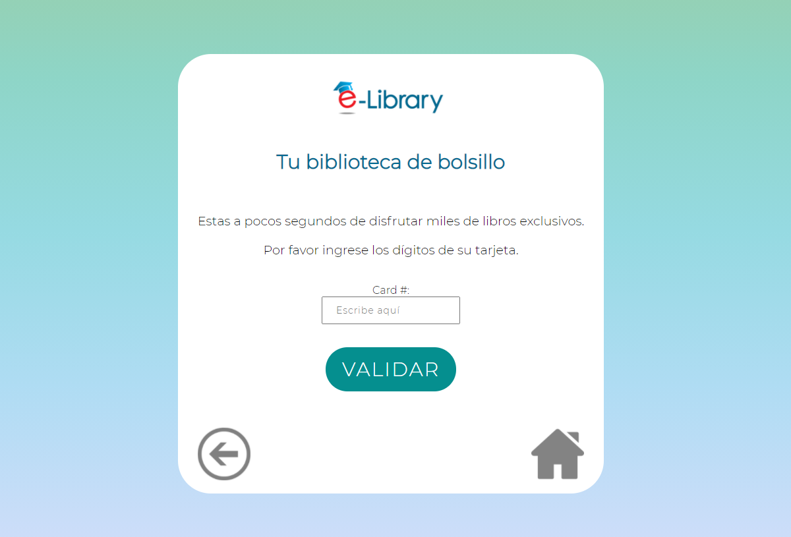
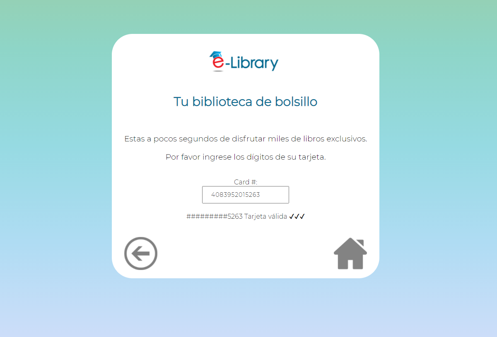
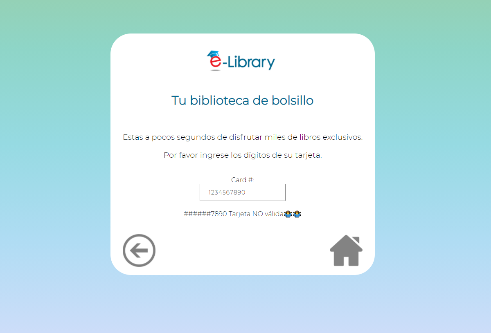

# Tarjeta de crédito válida
Este proyecto está orientado a usuarios de librerias virtuales. Por practicidad  la web se mostrara como si fuese el último paso de creación de perfil de usuario donde se requiere ingresar un número de tarjeta válida.
***
## Pasos a seguir
                                                                                                                                           
                                                                                                                                                     
* [1. Boceto en papel ](#2-Boceto-en-papel)
* [2. Figma](#3-Figma)
* [3. Feedback](#5-Feedback)
* [4. Manos a la obra](#5-Manos-a-la=obra)
* [5. Vista Final](#4-Vista-Final)
***

## 1. Boceto en papel 

En esta imagen se muestra la idea inicial de como estructurar el peoyecto.

## 2. Figma

Aqui se encuentra el [Prototipo en Figma](https://www.figma.com/file/FtlwH5Mi82PR6muP078gxd/Untitled?node-id=0%3A1), realizado durante los primeros dias del proyecto. Gracias a este prototipo pude recibir feedback por parte de mis compañeras de squad y usuarios en general.

## 3. Feedback
* Mejorar la redaccion de texto en la indicación. Pues no quedaba claro que era el paso final de un registro de perfil de usuario.
* Colocar botones sin funcionalidad
* No usar fonts muy diagonales

## 4. Manos a la obra:

###  Respecto a la estructura HTML
   * Use solamente un screen. Desde el inicio trate de simplificar el proyecto y centrar mi atención en la funcionalidad por ende solo existe un espacio de input  en lugar de un "form" largo.
   * Investigue acerca de ES6 "type = module" para no eliminar una parte importante de la hoja.
###  Respecto al diseño CSS
* Busque usar gradiente de colores de fondo. Sin embargo decidi colocar la información dentro de un div "content-panel" color blanco para facilitar la visión de letras, logo, input y botón.
* Use imágenes que asemejan botones  de "retornar" y "home" con el fin de mejorar el diseño, sin embargo no tienen funcionalidad por el momento. 
###  Respecto a la funcionalidad JS 
* Investigue y me adapte al ES6 y la terminología de "import" "export" desde un archivo a otro.  
* Decidí dividir en pasos las acciones que se llevarian a cabo para cada método "isValid" y Maskify". 

###  Respecto a los tests
* Considero que es muy importante aprender a testear y que luego seremos nosotras quienes escribamos el test. Fue una sorpresa para mi ver que tuve errores en el test pues yo pensaba que mi proyecto estaba listo. Sin embargo tuve que revisar de nuevo e incluso recibi feedback de una compañera respecto al error de "maskify"
## 5. Vista Final

* Finalmente, el proyecto de ve de esta manera. 

